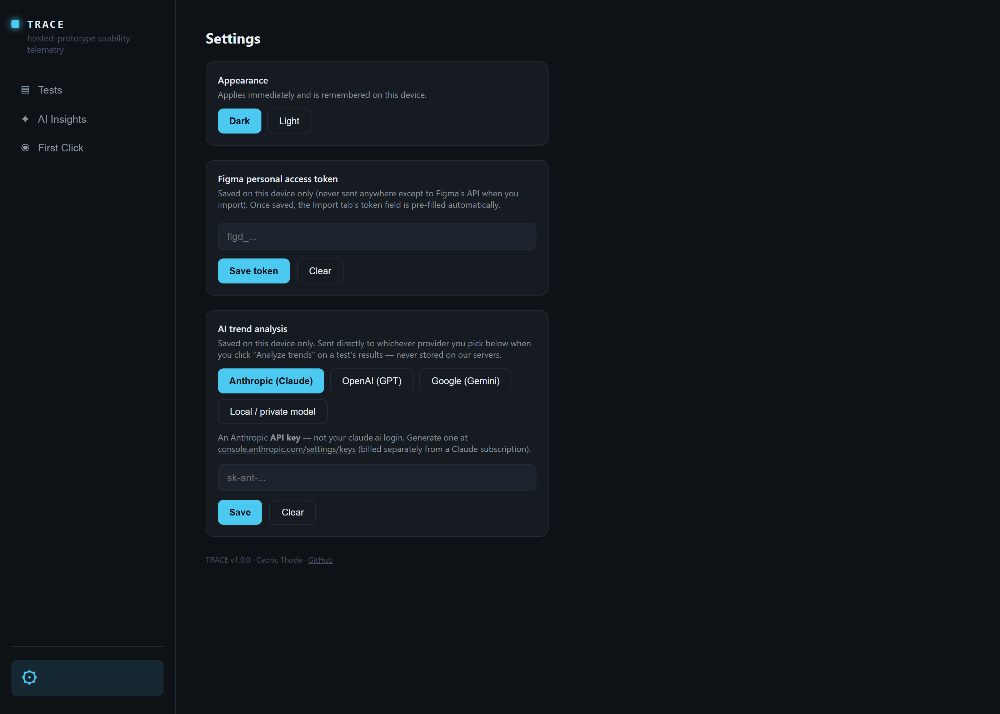
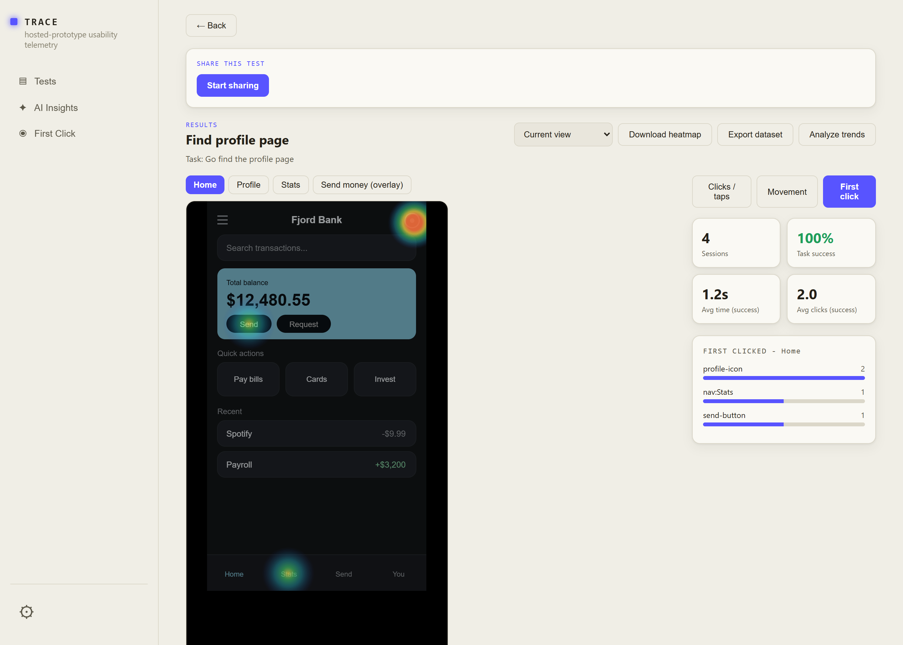
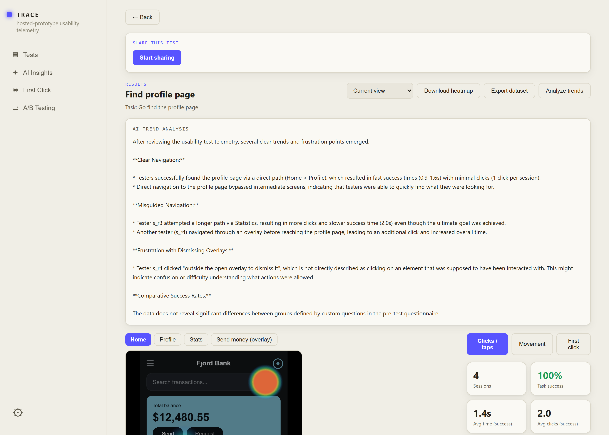
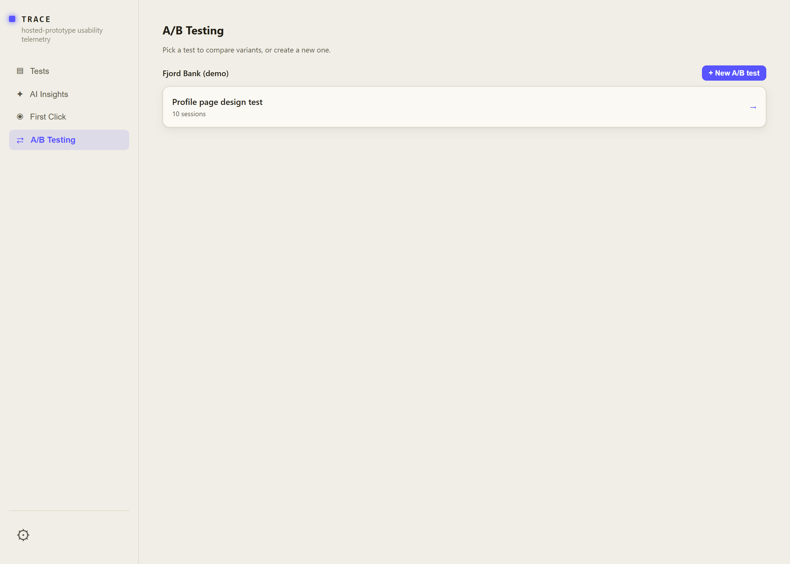
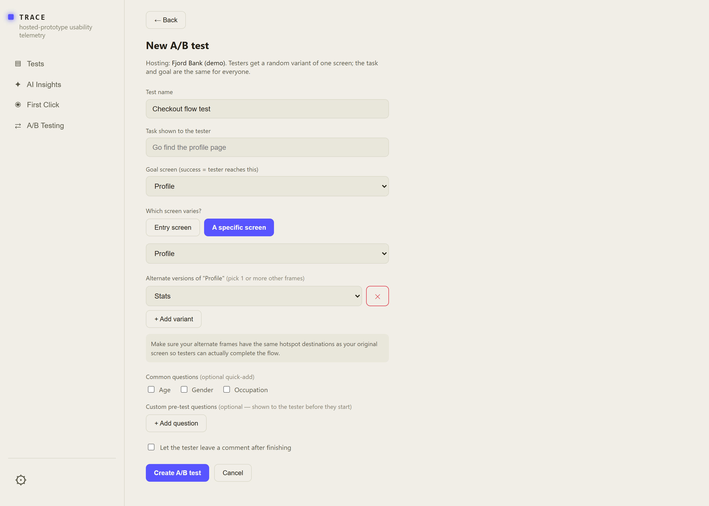
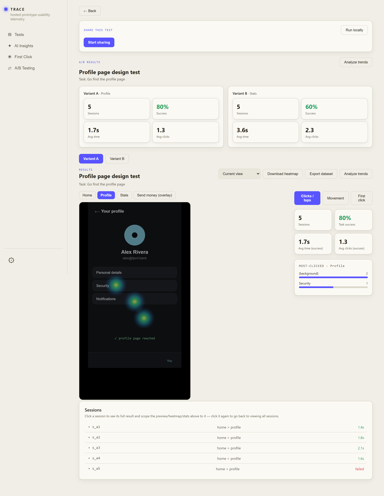

# TRACE

Usability-testing software for Figma prototypes: hosts an imported prototype, gives a tester a task to complete, and records their clicks, taps, and mouse movement as telemetry - then turns that into heatmaps and success/time/click stats per test.

<table><tr>
<td align="center" width="140"> <b>Tests</b></td>
<td align="center" width="140"> <b>AI Insights</b></td>
<td align="center" width="140"> <b>First Click</b></td>
<td align="center" width="140"> <b>A/B Testing</b></td>
</tr></table>

## Get it

Download [`release/TRACE Setup 1.1.0.exe`](release/) and run it - installs TRACE with a Start Menu shortcut and a proper uninstaller.

Windows only. No other setup needed - it's a self-contained desktop app.

> **First run:** since this build isn't code-signed, Windows SmartScreen will likely warn "Windows protected your PC." Click **More info → Run anyway** to continue.

## Features

- **Import prototypes from Figma**, each kept in its own folder - re-importing the same file refreshes it in place, and every folder can hold as many tests as you like. Import is parallelized under the hood so bigger prototypes come in faster, and hotspots that point at nested/hard-to-reach nodes get resolved automatically instead of silently failing.
- **Pre-test questionnaire**: add custom questions, or quick-toggle common ones (Age, Gender, Occupation) with the right input for each - Age is a bounded number field, Gender a dropdown.
- **Optional post-test comment box** so testers can describe their experience in their own words after finishing.
- **Run it yourself** in-app, or **share a link** so someone else can take the test remotely from anywhere - no deployment needed, just a button.
- **Results per test**: a click/movement heatmap over the actual screen - tuned so even a single click reads clearly instead of blending into the interface - success/time/click stats, and a session log. Click any session to zoom the whole view (heatmap, stats, most-clicked) down to just that one.
- **First Click mode**: a heatmap and ranking of where testers click *first* on a screen, not everything they ever click there - the classic first-click-testing signal for whether a layout reads the way you expect. Its own sidebar entry jumps straight into it for a chosen test.
- **Aggregate average heatmap**: a second heatmap mode that shows what fraction of *all* testers who reached a screen clicked in each spot, rather than a raw pile of clicks - so a handful of testers doesn't make everything look equally "hot." Pick it from the download dropdown, separate from downloading whatever's currently on screen.
- **AI trend analysis**: a button on a test's Results page sends its session data to an AI provider of your choice and gets back a written summary of trends and friction points - where testers hesitated, backtracked, or clicked the wrong thing - including whether any group (by age, occupation, or any custom pre-test question) struggled more than others. Works with Anthropic (Claude), OpenAI (GPT), Google (Gemini), or a private/local model (e.g. Ollama, LM Studio) for a fully free, offline option. The "AI Insights" sidebar entry jumps straight to it for a chosen test. See [How the AI analysis works](#how-the-ai-analysis-works) below.
- **A/B testing**, in its own "A/B Testing" panel: pick any screen in the flow (or just the entry screen) and give it 2+ alternate versions - each tester gets a random one, held stable for their whole session, while the task/goal and the rest of the flow stay identical for everyone. Results show a side-by-side comparison (sessions, success rate, avg time/clicks per variant) plus a full heatmap/stats breakdown per variant, and "Analyze trends" compares variants directly using the same AI integration above.
- **Downloadable evidence**: heatmap PNGs and plain-text session notes (task, result, questionnaire answers, comment) per session, or a full plain-text dataset export (every session's summary plus its raw click/movement trail) for a whole test.
- The admin view stays in sync automatically - a session recorded from a shared link shows up without needing to reload.
- **Settings**: switch between light (default) and dark mode, save a Figma personal access token once so you don't have to paste it in for every import, configure your AI provider of choice, and see the app's version, author, and a link back to this repo.
- A persistent left-hand navigation sidebar, in the style of a modern SaaS app, that scales smoothly with window size.

## Screenshots

**Tests tab** - every imported prototype gets its own folder, and each test underneath shows its session count and success rate at a glance. Import lives here too, top-right.

**Test page** - share a remote link, then watch results roll in: a click heatmap over the actual screen, success/time/click stats, and a most-clicked breakdown per frame. The dropdown next to "Download heatmap" switches between the current view and the aggregate-average heatmap, and "Analyze trends" gets an AI-written summary of the session data.

**Session log** - every recorded run, with its path through the prototype and completion time. Click one to scope the heatmap and stats above to just that session.

**Import** - paste a Figma prototype link (or drop a `.trace`/`.zip` package) and TRACE pulls the file, renders each frame, and extracts the click hotspots automatically.

**Settings** - toggle light/dark mode, save a Figma personal access token, configure an AI provider (Anthropic, OpenAI, Gemini, or a local model), and see the app's version and a link back to this repo.

**Dark mode** - the opt-in alternative to the default light theme.

**First Click** - its own sidebar entry, showing where testers clicked *first* on a screen rather than every click they made there, ranked alongside the heatmap.

**AI Insights** - pick a test and get a written trend analysis straight away. This example ran against a free local model (Ollama) with zero API cost.

**A/B Testing** - its own panel, separate from regular Tests, listing only tests set up with variants.

**Creating an A/B test** - pick which screen varies (the entry screen, or any specific one), add alternate frames as variants, and TRACE reminds you to keep their hotspots pointing to the same destinations so testers can actually finish the flow.

**A/B results** - a side-by-side comparison strip, then a full results view (heatmap, stats, session log) per variant behind a tab, and a cross-variant "Analyze trends" that actually contrasts the two rather than only ever seeing one variant's sessions.

## How the AI analysis works

Clicking **Analyze trends** doesn't just dump raw session JSON at a model. TRACE first builds a compact, plain-text summary: the test's name, task, and goal screen; aggregate stats (session count, success rate, average time/clicks); then per session, its result, duration, click count, the path of screens it visited, its pre-test Q&A and post-test comment, and its click/tap trail. Raw pointer-movement events are left out - they're noise for spotting trends and would just burn tokens.

If the test has a pre-test questionnaire, every question's answers get lined up against that session's outcome in a separate table - so age, occupation, or any custom question can be compared across testers directly, instead of the model having to piece a pattern together from scattered session entries itself.

That text is sent to TRACE's own server, which wraps it in one instruction: summarize the clearest trends and friction points, and - if questionnaire data is present - compare groups by their answers, but only report a difference the data actually supports (with only a session or two per group, say so rather than call it a trend). The server then forwards that prompt to whichever provider you picked in Settings:

| Provider | Endpoint |
|---|---|
| Anthropic (Claude) | `api.anthropic.com/v1/messages` |
| OpenAI (GPT) | `api.openai.com/v1/chat/completions` |
| Google (Gemini) | `generativelanguage.googleapis.com` |
| Local / private model | whatever OpenAI-compatible endpoint you configure (e.g. Ollama, LM Studio) |

Your API key (or local endpoint) travels with that one request and is never stored server-side or logged - same as it's never sent anywhere except that provider.

## Roadmap

What's shipped, and roughly when - the current build is versioned **1.1.0**; everything below it is grouped by the order features actually landed, referenced against the commit that shipped each batch.

### 1.1.0 - current
- **A/B testing**: its own panel and creation flow, variants on any screen in the flow (not just the entry point), a side-by-side comparison view, and a cross-variant AI analysis.
- Fixed the AI analysis misreading internal click-tracking shorthand (`"(background)"`, `"(overlay backdrop)"`) as if it named an actual UI element that appeared, rather than describing where a miss-click landed.

### 1.0.0 (`e35e7fb`)
- AI trend analysis compares testers by their pre-test questionnaire answers (age, occupation, or any custom question) against their outcomes, calling out which group struggled more - with a guardrail against over-reading a one- or two-session sample.
- README documents exactly what data gets sent to the AI and which provider endpoint is used.

### 0.4.0 - First Click testing & AI trend analysis (`c6d794b`)
- **First Click mode**: a heatmap and ranking of where testers click *first* on a screen, not everything they click.
- **AI trend analysis**: summarizes friction points and trends from a test's sessions via Anthropic (Claude), OpenAI (GPT), Google (Gemini), or a private/local model (e.g. Ollama) - free and offline with the local option.
- Dedicated "AI Insights" and "First Click" sidebar entries, each jumping straight to a chosen test.

### 0.3.0 - Light theme redesign & aggregate heatmap (`e844364`)
- Off-white light theme with box shadows and a new blue accent, set as the default (dark mode became opt-in).
- **Aggregate average heatmap** mode, showing what fraction of *all* testers clicked each spot, with its own download option.
- Import moved from the sidebar to a button on the Tests page.
- Dataset export switched from JSON to plain text.

### 0.2.0 - Settings, theming, and sidebar redesign (`84494b1`)
- Settings page: light/dark toggle, saved Figma personal access token, app version/author/GitHub link.
- Persistent left-hand sidebar that scales with window size.
- UI polish: icons, spacing, an animated settings gear.

### 0.1.0 - Baseline
- Import prototypes from Figma, host them for testing, and record click/tap/movement telemetry.
- Per-test click/movement heatmap, success/time/click stats, and a session log.
- Pre-test questionnaire (custom + quick-toggle demographic questions) and an optional post-test comment box.
- Run locally, or share a remote link.

## What's in this repo

Just the built app - `release/*.exe` - plus `package.json` / `package-lock.json` for reference. No application source code is included here.
