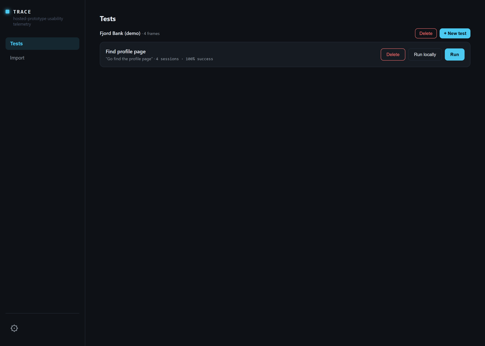
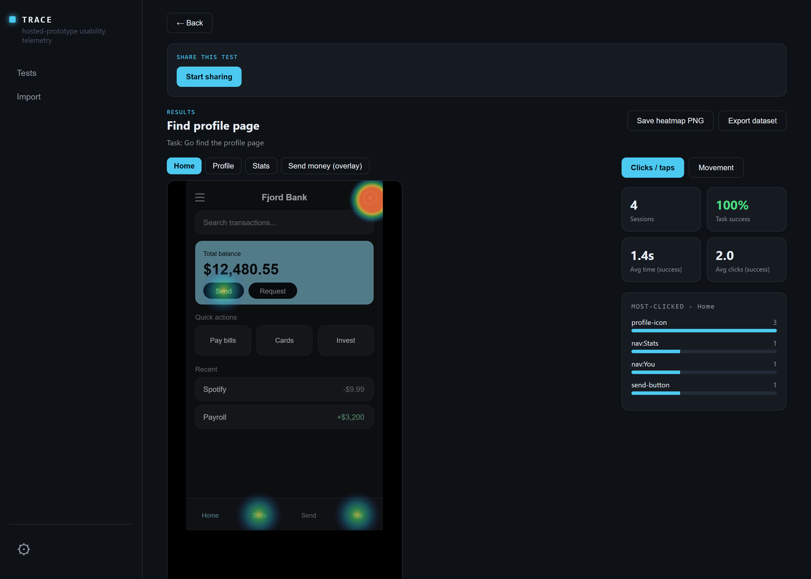
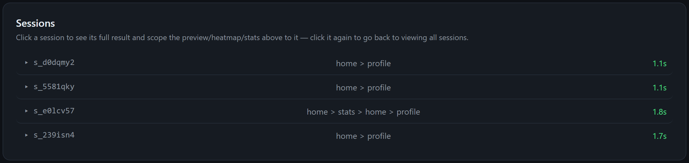
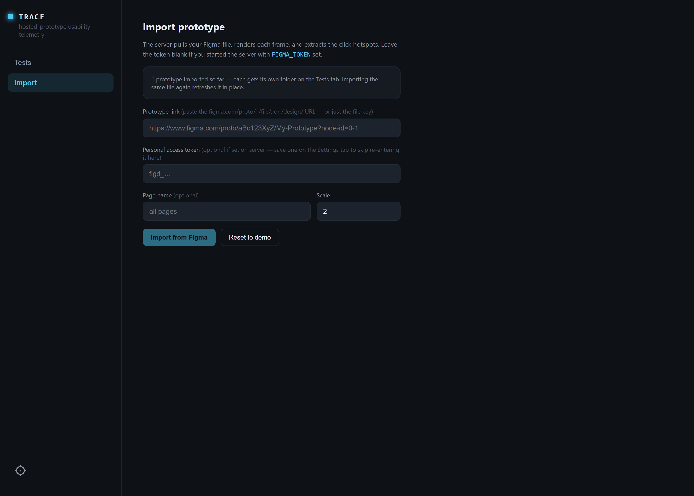
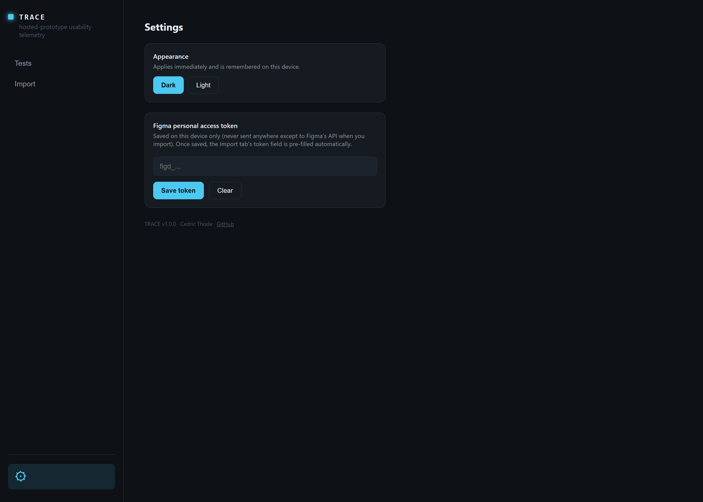

# TRACE

Usability-testing software for Figma prototypes: hosts an imported prototype, gives a tester a task to complete, and records their clicks, taps, and mouse movement as telemetry — then turns that into heatmaps and success/time/click stats per test.

## Get it

Download [`release/TRACE Setup 1.0.0.exe`](release/) and run it — installs TRACE with a Start Menu shortcut and a proper uninstaller.

Windows only. No other setup needed — it's a self-contained desktop app.

> **First run:** since this build isn't code-signed, Windows SmartScreen will likely warn "Windows protected your PC." Click **More info → Run anyway** to continue.

## Features

- **Import prototypes from Figma**, each kept in its own folder — re-importing the same file refreshes it in place, and every folder can hold as many tests as you like. Import is parallelized under the hood so bigger prototypes come in faster, and hotspots that point at nested/hard-to-reach nodes get resolved automatically instead of silently failing.
- **Pre-test questionnaire**: add custom questions, or quick-toggle common ones (Age, Gender, Occupation) with the right input for each — Age is a bounded number field, Gender a dropdown.
- **Optional post-test comment box** so testers can describe their experience in their own words after finishing.
- **Run it yourself** in-app, or **share a link** so someone else can take the test remotely from anywhere — no deployment needed, just a button.
- **Results per test**: click/movement heatmaps over the actual screen — tuned so even a single click reads clearly instead of blending into the interface — success/time/click stats, and a session log. Click any session to zoom the whole view (heatmap, stats, most-clicked) down to just that one.
- **Downloadable evidence**: heatmap PNGs and plain-text session notes (task, result, questionnaire answers, comment) per session, or the full dataset/heatmap for a whole test.
- The admin view stays in sync automatically — a session recorded from a shared link shows up without needing to reload.
- **Settings**: switch between dark and light mode, and save a Figma personal access token once so you don't have to paste it in for every import.
- A persistent left-hand navigation sidebar, in the style of a modern SaaS app, that scales smoothly with window size.

## Screenshots

**Tests tab** — every imported prototype gets its own folder, and each test underneath shows its session count and success rate at a glance.

**Test page** — share a remote link, then watch results roll in: a click heatmap over the actual screen, success/time/click stats, and a most-clicked breakdown per frame.

**Session log** — every recorded run, with its path through the prototype and completion time. Click one to scope the heatmap and stats above to just that session.

**Import** — paste a Figma prototype link (or drop a `.trace`/`.zip` package) and TRACE pulls the file, renders each frame, and extracts the click hotspots automatically.

**Settings** — toggle dark/light mode and save a Figma personal access token so it's remembered across imports.

## What's in this repo

Just the built app — `release/*.exe` — plus `package.json` / `package-lock.json` for reference. No application source code is included here.
